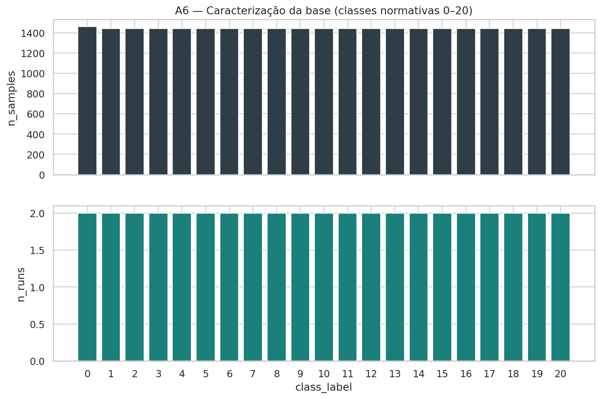
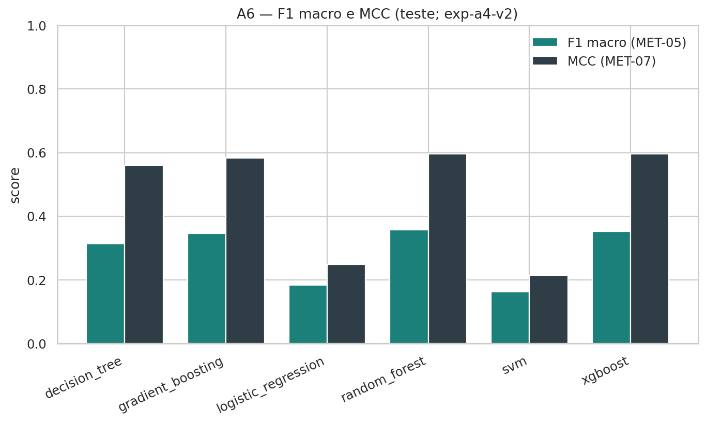
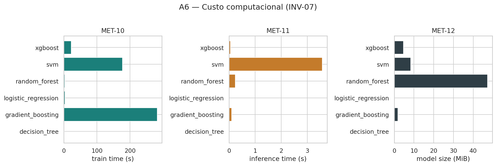
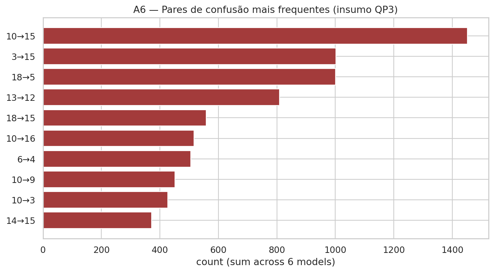
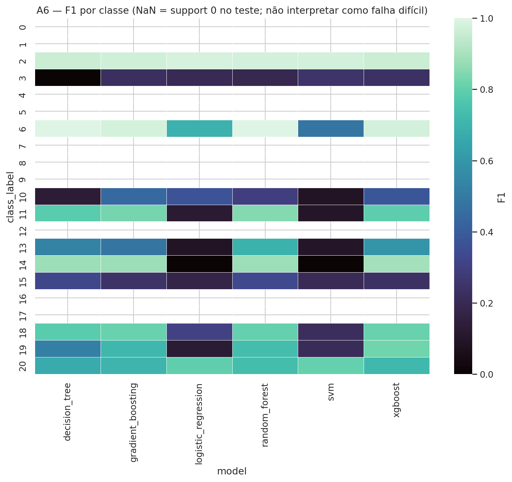

**Experimento oficial:** `exp-a4-v2`  
**Dataset:** `tep-canonical-v1`  
**Status científico:** APPROVE WITH ACCEPTED RISKS (AR-1–AR-5)  
**Rastreabilidade:** números citados provêm de `results/tables/A5_exp-a4-v2__*` e `results/tables/A8_exp-a4-v2__*` (DOC-R03).

---

# Resumo

Este artigo apresenta um benchmark reproduzível de seis famílias clássicas de aprendizado de máquina — regressão logística, árvore de decisão, random forest, gradient boosting, SVM e XGBoost — para diagnóstico multiclasse de falhas no Tennessee Eastman Process (TEP). O protocolo fixa a execução do processo (`run`) como unidade de divisão e de análise, exige o mesmo manifesto e o mesmo pré-processamento para todos os modelos, isola o conjunto de teste até o congelamento das configurações e avalia desempenho e custo de forma multicritério. No experimento `exp-a4-v2`, random forest, XGBoost e gradient boosting lideram as métricas globais no teste; regressão logística e SVM linear formam o grupo inferior. O líder em acurácia (XGBoost, 0,618) não coincide com o líder em F1 macro e MCC (random forest, 0,357 e 0,597). Entre classes presentes no holdout, as falhas 3, 15 e 10 são as de menor F1 médio; as confusões 10→15 e 3→15 são as mais frequentes. Pelos critérios binários da SPEC-000 §4, H1–H4 são *corroboradas* no holdout. Em nível de execução (SPEC-008; acurácia por `run`, n=11), o teste de Friedman rejeita igualdade global (p=0,015); Wilcoxon+Holm na família H1 corrobora ensembles > LR, enquanto a família H2 não corrobora RF/XGB > DT. Riscos estruturais aceitos (AR-1–AR-5) incluem cobertura disjunta de classes entre validação e teste, scorer de acurácia na seleção, grids desiguais, macro com C=21 e poder limitado.

**Palavras-chave:** Tennessee Eastman Process; diagnóstico de falhas; aprendizado de máquina clássico; reprodutibilidade; vazamento de dados; avaliação multicritério.

---

# 1. Introdução

O diagnóstico automático de falhas em processos químicos industriais exige mapear variáveis de processo a condições operacionais (normal versus modos de falha) com protocolo experimental transparente. Comparações entre classificadores frequentemente misturam partições inconsistentes, permitem vazamento temporal entre treino e teste e concluem “melhor modelo” apenas por acurácia simples — métrica frágil sob desbalanceamento entre classes.

O Tennessee Eastman Process (TEP) [1] é um ambiente simulado de referência com 52 variáveis de processo e 21 classes (condição normal e 20 falhas). Este trabalho desenvolve um **benchmark reproduzível** de seis famílias clássicas de aprendizado de máquina sob um único protocolo, respondendo a cinco questões de pesquisa (QP1–QP5) e avaliando quatro hipóteses (H1–H4).

**Contribuições.** (i) protocolo anti-vazamento com divisão agrupada por execução; (ii) avaliação conjunta de desempenho e custo computacional (proibição de ranking por métrica única); (iii) artefatos versionados (manifesto, predições, métricas, figuras) que permitem recomputar qualquer número reportado; (iv) respostas explícitas a QP1–QP5 e vereditos individuais de H1–H4, com evidência §4 no holdout e testes SPEC-008 em nível de `run_id`.

**Questões de pesquisa**

- **QP1.** Quais algoritmos clássicos apresentam o melhor desempenho global?
- **QP2.** O desempenho é consistente sob equilíbrio entre classes?
- **QP3.** Quais falhas são sistematicamente mais difíceis?
- **QP4.** Métodos mais complexos justificam maior custo?
- **QP5.** Qual o melhor compromisso desempenho × tempo × tamanho?

**Hipóteses**

- **H1.** Ensembles em árvore superam regressão logística (F1 e/ou MCC).
- **H2.** XGBoost e random forest superam LR e árvore isolada (F1 e MCC).
- **H3.** LR permanece competitiva em custo, com F1 reduzido nas falhas difíceis.
- **H4.** O melhor por acurácia não coincide com o melhor por F1, MCC ou custo de inferência.

---

# 2. Fundamentação sobre diagnóstico de falhas e TEP

## 2.1 Diagnóstico de falhas orientado a dados

Métodos clássicos de monitoramento e diagnóstico (PCA dinâmico, CVA, PLS e variantes) exploram correlação entre variáveis para detecção e, em alguns casos, isolamento de falhas [2,3]. Abordagens de aprendizado supervisionado tratam o problema como classificação multiclasse. A qualidade da conclusão depende criticamente da unidade amostral usada na divisão e nos testes estatísticos.

## 2.2 Tennessee Eastman Process

O TEP [1] simula uma planta com reator, condensador, separador, stripper e reciclo. Cada execução (*run*) induz (ou não) uma falha e gera uma série temporal de observações. Neste estudo, a tarefa é classificar vetores de 52 variáveis em uma de 21 classes. A **unidade experimental** é a execução, não a linha individual: observações do mesmo `run` são temporalmente correlacionadas e não podem ser tratadas como amostras independentes na divisão nem nos testes de hipótese (INV-09; UE-03).

## 2.3 Avaliação multicritério

Em cenários com 21 classes e desbalanceamento, acurácia simples pode mascarar fracasso em falhas minoritárias. Adotamos o conjunto de métricas globais (acurácia, acurácia balanceada, precisão/revocação/F1 macro, F1 ponderada, MCC), métricas por classe, matrizes de confusão e custos (tempo de treino, tempo de inferência, tamanho do modelo). Nenhuma conclusão de superioridade se apoia apenas em acurácia [10].

---

# 3. Trabalhos relacionados

Yin et al. [4] comparam métodos data-driven no TEP e evidenciam a sensibilidade dos resultados ao protocolo. Conjuntos derivados do TEP ampliaram o uso em detecção de anomalias [5]. Ensembles de árvores [6], boosting escalável [7] e SVMs [8] são famílias clássicas recorrentes em classificação tabular.

O presente trabalho diferencia-se por: (1) fixar a execução como unidade de divisão com verificação automatizada de disjunção; (2) obrigar o mesmo pipeline para seis modelos; (3) isolar o teste até o congelamento; (4) reportar custo sempre que se discute “melhor modelo”; (5) delimitar o escopo aos métodos clássicos, como referência para estudos futuros com redes profundas ou modelos físico-informados.

---

# 4. Materiais e métodos

## 4.1 Dataset canônico

Utilizamos a versão canônica `tep-canonical-v1`: 52 atributos, 21 classes, 42 execuções e 30 260 linhas (Tabela 1). A auditoria prévia do pacote bruto e o registro canônico precedem qualquer modelagem.

**Tabela 1.** Sumário do dataset canônico (`A6_exp-a4-v2__01_dataset_summary.csv`).

| Item | Valor |
|---|---:|
| Features | 52 |
| Classes | 21 |
| Runs | 42 |
| Linhas | 30 260 |
| Versão | tep-canonical-v1 |

## 4.2 Divisão agrupada por execução

A estratégia `stratified_one_train_per_class_remaining_split_val_test` reserva um `run` por classe ao treino e divide o restante aproximadamente 50/50 entre validação e teste (semente 42). Resultado: 21 runs de treino, 10 de validação e 11 de teste. A checagem de interseção vazia de `run_id` passou no manifesto A3.

**Limitação estrutural (AR-1).** Com apenas dois `runs` por classe, validação e teste **não cobrem simultaneamente as 21 classes**. Neste experimento, os conjuntos de classes de validação e de teste são disjuntos (validação: 0, 1, 4, 5, 7, 8, 9, 12, 16, 17; teste: 2, 3, 6, 10, 11, 13, 14, 15, 18, 19, 20).

## 4.3 Pré-processamento

A versão `preprocessor_v1` ajusta transformações dependentes dos dados (padronização) **exclusivamente no treino** e apenas aplica (`transform`) validação e teste.

## 4.4 Modelos

Seis classificadores sob o mesmo manifesto e o mesmo pré-processamento (scikit-learn [9] e XGBoost [7]):

1. Regressão logística (MOD-1)
2. Árvore de decisão (MOD-2)
3. Random forest (MOD-3) [6]
4. Gradient boosting sklearn (MOD-4)
5. SVM linear (MOD-5) [8]
6. XGBoost (MOD-6) [7]

## 4.5 Seleção de hiperparâmetros

A busca usa apenas treino/validação. Os espaços desta baseline (`exp-a4-v2`) são reduzidos e **desiguais** entre famílias (AR-3): gradient boosting com dois candidatos; SVM restrito a kernel linear; XGBoost com oito candidatos. Scorer de seleção = acurácia amostral na validação (AR-2). Hiperparâmetros congelados: Tabela 2.

**Tabela 2.** Hiperparâmetros finais (`A6_exp-a4-v2__02_hyperparameters.csv`).

| Modelo | Parâmetros principais |
|---|---|
| Regressão logística | C=10, lbfgs, max_iter=1000 |
| Árvore de decisão | max_depth=20, min_samples_leaf=5 |
| Random forest | n=200, max_depth=20 |
| Gradient boosting | n=50, η=0,1, max_depth=3 |
| SVM | C=10, kernel linear |
| XGBoost | n=100, η=0,1, max_depth=6, hist |

## 4.6 Métricas

Reportamos MET-01 a MET-12. F1 macro e acurácia balanceada usam C=21: classes ausentes no teste entram com contribuição nula e deprimem essas métricas em relação à acurácia (AR-4). Verificação formal: `formula_checks_ok=True` nos seis modelos (`A5_exp-a4-v2__global_metrics.csv`).

---

# 5. Protocolo reprodutível

O pipeline segue a ordem fixa: auditoria → análise exploratória → divisão → pré-processamento → treinamento/seleção → avaliação final → estatística formal → figuras.

- Semente: 42 (`configs/seeds.yaml`).
- Manifesto: `data/processed/split_manifest_v1.json`.
- Configuração: `configs/experiments/exp-a4-v2.yaml`.
- Ambiente (snapshot A4): Python 3.12.7, scikit-learn 1.9.1, XGBoost 2.1.4.
- Predições e métricas em `results/`; figuras/tabelas de publicação em `article/` (geradas somente a partir de `results/`).
- Verificação operacional: `make reproduce` (pytest + evaluate + statistics + figures; sem retreino).

O dry-run (`scientific_validity: false`) não alimenta este manuscrito. Tuning ampliado (SPEC-006A) não foi executado nesta baseline.

---

# 6. Resultados

## 6.1 Desempenho global e custo

A Tabela 3 e as Figuras 2–3 resumem o teste.

**Tabela 3.** Métricas globais e custo no conjunto de teste (`A5_exp-a4-v2__global_metrics.csv`).

| Modelo | Acc | BA | F1_m | MCC | Treino (s) | Inf. (s) | Bytes |
|---|---:|---:|---:|---:|---:|---:|---:|
| Reg. logística | 0,275 | 0,164 | 0,184 | 0,250 | 3,65 | 0,003 | 10 020 |
| Árvore | 0,564 | 0,303 | 0,314 | 0,560 | 1,36 | 0,0015 | 158 662 |
| Random forest | 0,617 | **0,333** | **0,357** | **0,597** | 3,09 | 0,243 | 49 567 094 |
| Grad. boosting | 0,608 | 0,321 | 0,347 | 0,584 | 281,89 | 0,101 | 1 901 442 |
| SVM linear | 0,237 | 0,150 | 0,163 | 0,215 | 177,03 | 3,575 | 8 782 836 |
| XGBoost | **0,618** | 0,330 | 0,353 | 0,596 | 22,28 | 0,052 | 4 910 294 |

## 6.2 QP1 — Desempenho global

Os conjuntos baseados em árvores (RF, XGBoost, GB) e, em seguida, a árvore isolada dominam as métricas globais; regressão logística e SVM linear formam o grupo inferior. Por acurácia lidera XGBoost (0,618); por F1 macro e MCC lidera random forest (0,357 e 0,597). Não há ranking oficial por métrica única.

## 6.3 QP2 — Equilíbrio entre classes

O ranking por acurácia (XGB → RF → GB → DT → LR → SVM) **não** coincide com o ranking por BA/F1/MCC (RF → XGB → …). A diferença XGB–RF é pequena, mas suficiente para afirmar inconsistência parcial entre critérios. A lacuna acurácia ≫ BA/F1 é compatível com a média sobre 21 classes incluindo 10 ausentes no teste.

## 6.4 QP3 — Falhas difíceis

Entre classes com `support > 0`, os menores F1 médios (seis modelos) ocorrem nas falhas **3** (0,184), **15** (0,252) e **10** (0,283). Pares mais frequentes (soma entre modelos): 10→15 (1451), 3→15 (1002), 18→5 (1001), 13→12 (809) (Figuras 4–5; `A5_exp-a4-v2__qp3_confused_faults.json`). Classes com `support = 0` não são interpretadas como “difíceis observadas” neste holdout. Não atribuímos mecanismo físico a essas confusões.

## 6.5 QP4 — Complexidade versus custo

RF obtém o melhor F1/MCC com treino baixo, porém o maior artefato. XGBoost quase empata RF com inferência mais rápida e tamanho cerca de 10× menor. GB não supera RF/XGB e tem o maior tempo de treino (≈282 s): o ganho observado não justifica esse custo nesta baseline. SVM linear combina custo alto e pior desempenho preditivo.

## 6.6 QP5 — Compromisso multicritério

- Maximizar F1/MCC: **random forest**.
- Compromisso desempenho/custo: **XGBoost**.
- Extremo barato com desempenho intermediário: **árvore de decisão**.
- Extremo compacto com desempenho global baixo: **regressão logística**.

## 6.7 Análise estatística (SPEC-008)

Unidade experimental: `run_id`; n=11 runs de teste; métrica pareada: acurácia dentro do run (`run_accuracy`). Fonte: `results/tables/A8_exp-a4-v2__*` e `results/metrics/A8_exp-a4-v2__statistics.json`.

**Friedman** (6 modelos): χ² = 14,079; p = 0,015 — rejeita igualdade global de ranks.

**Médias de `run_accuracy`** (`A8_…__run_metric_summary.csv`): RF 0,635; XGB 0,630; GB 0,614; DT 0,579; LR 0,313; SVM 0,287.

**Wilcoxon com Holm** *dentro* de cada família planejada:

- **H1** (3 pares RF/GB/XGB vs LR): todos significativos → run-level **corroborada**.
- **H2** (4 pares RF/XGB vs LR/DT): **nenhum** dos quatro pares permanece significativo após Holm (incluindo RF/XGB vs LR nesta família de tamanho 4, ao contrário da família H1 de tamanho 3).

Limitação: uma semente e um split (AR-5); EST-01 entre sementes não aplicável.

## 6.8 Avaliação de H1–H4

Dois planos de evidência: (1) critérios binários SPEC-000 §4 sobre F1/MCC/custo globais; (2) Friedman/Wilcoxon sobre `run_accuracy`.

| Hipótese | Holdout (§4) | Run-level (SPEC-008) |
|---|---|---|
| **H1** | **Corroborada** | **Corroborada** (Holm, família 3) |
| **H2** | **Corroborada** | **Não corroborada** (família 4) |
| **H3** | **Corroborada** | N/A (critério custo/F1 por classe) |
| **H4** | **Corroborada** | N/A (multicritério) |

H4: líderes distintos — XGB (acurácia), RF (F1/MCC), DT (inferência).

---

# 7. Discussão

Os resultados reforçam que **escolha de modelo é multicritério**: acurácia, F1/MCC e custo produzem líderes distintos (H4). Ensembles superam LR de forma consistente no holdout e no Wilcoxon H1; a família H2 (4 pares) **não** corrobora RF/XGB em `run_accuracy` após Holm. LR permanece atrativa sob restrição forte de armazenamento/inferência (H3).

A interpretação deve incorporar as restrições do desenho experimental (riscos aceitos AR-1–AR-5). Em particular: BA e F1 macro com C=21 incluem zeros por ausência de classe no teste; a seleção por validação ocorreu em classes disjuntas do teste; orçamentos de busca desiguais limitam atribuições à “família algorítmica”; semente única e n=11 limitam o poder dos contrastes Wilcoxon.

Importâncias de atributos, quando analisadas em trabalhos derivados, devem permanecer descritivas do comportamento do modelo — nunca evidência causal do processo físico do TEP (INV-08).

---

# 8. Ameaças à validade

## 8.1 Validade interna

Mitigadas: disjunção de `run_id`; seleção sem consulta ao teste; fit de transformações só no treino; protocolo único. **Não mitigada estruturalmente:** cobertura disjunta de classes entre validação e teste. O scorer de seleção por acurácia amostral na validação está desalinhado com F1/BA sob desbalanceamento e sob o descompasso de classes.

## 8.2 Validade estatística

Rankings e critérios §4 usam métricas globais do holdout; testes Friedman/Wilcoxon [11,12] agregam por `run_id` (n=11) antes da inferência (INV-09). Holm corrige famílias planejadas H1/H2. Poder limitado por n pequeno e semente única. Orçamentos de busca desiguais reduzem a comparabilidade entre famílias. A redação evita conclusões por métrica única.

## 8.3 Validade de constructo

Não interpretamos importância de atributos como física do TEP. Custo é sempre discutido junto ao desempenho. O constructo “macro sobre 21 classes” inclui zeros por ausência — documentado; o heatmap A6 usa NaN onde `support = 0`.

## 8.4 Validade externa

Resultados em TEP simulado não generalizam automaticamente a plantas reais; o escopo é deliberadamente o TEP como referência. O estudo cobre apenas métodos clássicos e uma baseline de busca reduzida — não o máximo de cada família sob tuning ampliado.

## 8.5 Reprodutibilidade (transversal)

Manifesto, semente, snapshot de ambiente, predições e métricas estão versionados. Residual: `git_dirty: true` no snapshot A4.

## 8.6 Riscos metodológicos aceitos (ACCEPTED RISK)

Os riscos abaixo **não** podem ser eliminados sem novo desenho experimental e, portanto, são **aceitos** para `exp-a4-v2`:

| ID | Risco | Mitigação | Residual |
|---|---|---|---|
| **AR-1** | Classes val ∩ teste = ∅ | Manifesto A3; INV-05; discussão explícita | HP não otimizados nas falhas do teste |
| **AR-2** | Scorer = acurácia amostral | Publicação multicritério (INV-06/07) | Desalinhamento seleção ↔ F1/BA |
| **AR-3** | Grids desiguais / SVM linear | Sem claim de esforço igual; YAML versionado | Diferenças misturam família e budget |
| **AR-4** | Macro C=21 com ~10 ausentes | Zeros documentados; heatmap NaN | Macro ≠ cobertura das 21 falhas |
| **AR-5** | Semente única / n=11 | SPEC-008 declara unidade e n; H2 não corroborada | Baixo poder; sensibilidade a seed não medida |

---

# 9. Conclusões

Apresentamos um benchmark reproduzível de seis classificadores clássicos para diagnóstico multiclasse no TEP, com divisão por execução, isolamento do teste e avaliação multicritério. No experimento `exp-a4-v2`: RF/XGB/GB lideram; LR e SVM linear ficam atrás; XGBoost lidera acurácia enquanto RF lidera F1/MCC; falhas 3, 15 e 10 são as mais difíceis entre as presentes; XGBoost oferece o melhor compromisso observacional desempenho/custo. H1–H4 são *corroboradas* em §4; em run-level, H1 é corroborada e H2 não (Wilcoxon+Holm, `run_accuracy`, n=11).

As conclusões de ranking e de hipóteses devem ser lidas sob os **riscos aceitos** AR-1–AR-5. Nenhum desses riscos foi ocultado; nenhum foi “resolvido” alterando o protocolo congelado.

Trabalhos futuros incluem: (i) dataset canônico com mais `runs` por classe e splits com overlap controlado de classes entre val/teste; (ii) replicação multi-semente para aumentar o poder dos contrastes Wilcoxon; (iii) tuning documentado com novo identificador de experimento; (iv) uso deste protocolo como referência clássica para modelos profundos, físico-informados e detecção precoce.

---

# 10. Referências

1. Downs, J. J., & Vogel, E. F. (1993). A plant-wide industrial process control problem. *Computers & Chemical Engineering*, 17(3), 245–255.

2. Russell, E. L., Chiang, L. H., & Braatz, R. D. (2000). Fault detection in industrial processes using canonical variate analysis and dynamic principal component analysis. *Chemometrics and Intelligent Laboratory Systems*, 51(1), 81–93.

3. Chiang, L. H., Russell, E. L., & Braatz, R. D. (2001). *Fault Detection and Diagnosis in Industrial Systems*. Springer.

4. Yin, S., Ding, S. X., Haghani, A., Hao, H., & Zhang, P. (2012). A comparison study of basic data-driven fault diagnosis and process monitoring methods on the benchmark Tennessee Eastman process. *Journal of Process Control*, 22(9), 1567–1581.

5. Rieth, C. A., Amsel, B. D., Tran, R., & Cook, M. B. (2017). Additional Tennessee Eastman Process Simulation Dataset for Anomaly Detection Evaluation. Harvard Dataverse.

6. Breiman, L. (2001). Random Forests. *Machine Learning*, 45(1), 5–32.

7. Chen, T., & Guestrin, C. (2016). XGBoost: A Scalable Tree Boosting System. *KDD*, 785–794.

8. Cortes, C., & Vapnik, V. (1995). Support-Vector Networks. *Machine Learning*, 20(3), 273–297.

9. Pedregosa, F., et al. (2011). Scikit-learn: Machine Learning in Python. *JMLR*, 12, 2825–2830.

10. Matthews, B. W. (1975). Comparison of the predicted and observed secondary structure of T4 phage lysozyme. *Biochimica et Biophysica Acta*, 405(2), 442–451.

11. Friedman, M. (1937). The Use of Ranks to Avoid the Assumption of Normality Implicit in the Analysis of Variance. *JASA*, 32(200), 675–701.

12. Wilcoxon, F. (1945). Individual Comparisons by Ranking Methods. *Biometrics Bulletin*, 1(6), 80–83.

---

# Apêndice A — Índice de artefatos

| Conteúdo | Caminho |
|---|---|
| Configuração | `configs/experiments/exp-a4-v2.yaml` |
| Snapshot A4 | `results/metadata/exp-a4-v2__config_snapshot.json` |
| Métricas A5 | `results/tables/A5_exp-a4-v2__global_metrics.csv` |
| Custo A5 | `results/tables/A5_exp-a4-v2__cost_metrics.csv` |
| Por classe | `results/tables/A5_exp-a4-v2__per_class_metrics.csv` |
| QP3 | `results/tables/A5_exp-a4-v2__qp3_confused_faults.json` |
| Friedman SPEC-008 | `results/tables/A8_exp-a4-v2__friedman.json` |
| Wilcoxon H1/H2 | `results/tables/A8_exp-a4-v2__wilcoxon_H*_family.csv` |
| Bundle estatístico | `results/metrics/A8_exp-a4-v2__statistics.json` |
| Relatório A7 | `reports/technical/A7_technical_report.md` |
| Figuras A6 | `article/figures/A6_exp-a4-v2__*` |
| Review final | `reports/technical/A8_scientific_review_exp-a4-v3_post_remediation.md` |

---

# Apêndice B — Critérios de aceite

CA-07 (QP1–QP5), CA-08 (H1–H4) e CA-10 (estrutura de 10 seções + ameaças nas quatro categorias) são endereçados neste documento. Números alinhados a A5/A6/A8 estatístico (DOC-R03). Relatório operacional expandido: Entrega A7.
